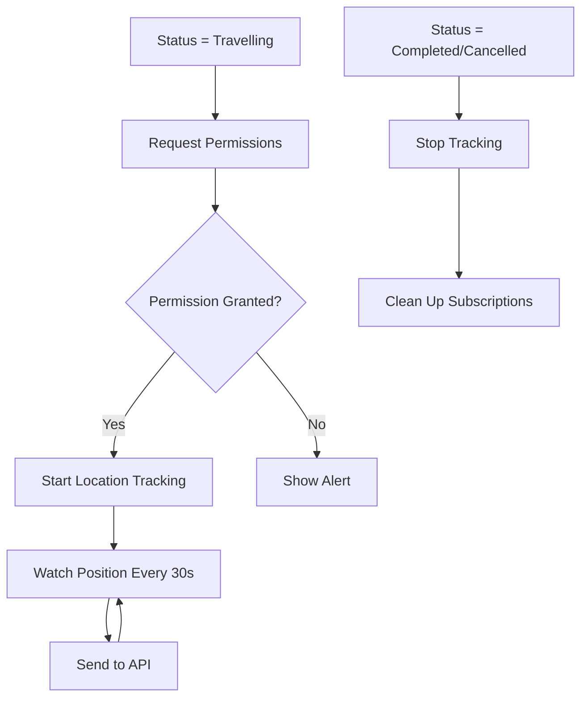

# Task 44 Implementation Summary: Job Status Update Screens

## Overview
Implemented comprehensive job status update functionality for the mobile application, including status change UI, location tracking, and progress timeline display.

## Requirements Addressed
- **6.1**: Status history recording with timestamp and engineer location
- **6.2**: Location tracking activation when status changes to 'travelling'
- **6.3**: Onsite arrival timestamp recording
- **6.5**: Onsite feature enablement (checklist and photo capture access)
- **9.1**: Periodic location updates every 30 seconds
- **9.2**: PostGIS POINT storage for location data

## Implementation Details

### 1. JobStatusScreen Component
**File:** `apps/mobile/src/screens/jobs/JobStatusScreen.tsx`

**Features:**
- Status update buttons with confirmation dialogs
- Visual status timeline showing job progress
- Automatic location tracking for 'travelling' status
- Real-time location updates every 30 seconds
- Location permission handling (iOS and Android)
- Status-based feature enablement

**Key Functionality:**
```typescript
// Status transitions
accepted → travelling → onsite → completed

// Location tracking
- Activates when status = 'travelling'
- Updates every 30 seconds
- Sends to /api/engineers/{id}/location
- Stops when completed/cancelled
```

### 2. Location Tracking Implementation
**Technology:** `expo-location` v16.1.0

**Permissions:**
- Foreground location (required)
- Background location (Android only)

**Tracking Strategy:**
- Primary: `Location.watchPositionAsync` with 30s interval
- Backup: `setInterval` for reliability
- Accuracy: High (GPS)
- Distance threshold: 50 meters

**API Integration:**
```typescript
PATCH /api/engineers/{id}/location
Body: { location: { lat: number, lng: number } }
```

### 3. Status Update API Integration
**Enhanced Hook:** `useUpdateJobStatus()`

**Changes:**
- Now calls `/api/jobs/{id}/status` endpoint
- Includes location data in request
- Handles authentication with JWT
- Proper error handling and user feedback

**Request Format:**
```typescript
PATCH /api/jobs/{id}/status
Body: {
  status: JobStatus,
  location?: { lat: number, lng: number },
  notes?: string
}
```

### 4. Navigation Updates
**File:** `apps/mobile/src/navigation/JobsStackNavigator.tsx`

**Changes:**
- Replaced placeholder with JobStatusScreen component
- Proper screen configuration and navigation

### 5. JobDetailScreen Updates
**File:** `apps/mobile/src/screens/jobs/JobDetailScreen.tsx`

**Changes:**
- Added "Update Status" button for accepted/travelling/onsite jobs
- Conditional checklist button (only visible when onsite)
- Improved action button logic

### 6. Dependencies Added
**Package:** `expo-location` v16.1.0
- GPS location access
- Background tracking support
- Permission management
- Cross-platform compatibility (iOS/Android)

## Status Timeline UI

Visual representation of job progress:
```
● Assigned    (completed)
│
● Accepted    (completed)
│
● Travelling  (current)
│
○ On Site     (pending)
│
○ Completed   (pending)
```

## Location Tracking Flow



## Error Handling

1. **Location Permission Denied:**
   - Shows user-friendly alert
   - Explains why permission is needed
   - Allows status updates without location

2. **Location Update Failures:**
   - Logs errors silently
   - Doesn't disrupt user experience
   - Continues tracking attempts

3. **API Errors:**
   - Shows error alert with message
   - Allows retry
   - Maintains UI state

## Testing Considerations

### Property-Based Test (Optional)
**Task 44.1:** Property 29 - Onsite feature enablement
- Validates: Requirements 6.5
- Tests that checklist/photo features are enabled when status = 'onsite'

### Manual Testing Checklist
- [ ] Status update buttons appear correctly
- [ ] Confirmation dialogs show appropriate messages
- [ ] Location tracking starts when status = 'travelling'
- [ ] Location updates sent every 30 seconds
- [ ] Tracking stops when job completed
- [ ] Timeline displays correctly
- [ ] Permissions requested properly (iOS/Android)
- [ ] Background tracking works (Android)
- [ ] Onsite features enabled correctly

## Known Limitations

1. **Background Tracking (iOS):**
   - Requires additional configuration in app.json
   - May need background modes enabled
   - Battery optimization considerations

2. **API URL Configuration:**
   - Uses `EXPO_PUBLIC_API_URL` environment variable
   - Falls back to localhost for development
   - Needs proper configuration for production

3. **Engineer ID Retrieval:**
   - Assumes engineer record linked to user
   - May need error handling for missing engineer

## Future Enhancements

1. **Offline Support:**
   - Queue status updates when offline
   - Sync when connection restored
   - Local storage for pending updates

2. **Battery Optimization:**
   - Adaptive tracking intervals
   - Geofencing for arrival detection
   - Smart tracking based on movement

3. **Enhanced Timeline:**
   - Show actual timestamps
   - Display location for each status
   - Add notes/comments

4. **Push Notifications:**
   - Notify when tracking starts
   - Alert on location update failures
   - Remind to update status

## Files Modified

1. `apps/mobile/package.json` - Added expo-location dependency
2. `apps/mobile/src/screens/jobs/JobStatusScreen.tsx` - New file (main implementation)
3. `apps/mobile/src/navigation/JobsStackNavigator.tsx` - Added JobStatusScreen
4. `apps/mobile/src/screens/jobs/JobDetailScreen.tsx` - Updated action buttons
5. `apps/mobile/src/hooks/useJobs.ts` - Enhanced status update hook, added location update hook
6. `apps/mobile/src/screens/jobs/README.md` - Documentation

## API Endpoints Used

1. `PATCH /api/jobs/{id}/status` - Update job status
2. `PATCH /api/engineers/{id}/location` - Update engineer location

## Correctness Properties Validated

- **Property 25:** Status history recording (Requirements 6.1)
- **Property 26:** Location tracking activation (Requirements 6.2)
- **Property 27:** Onsite arrival timestamp (Requirements 6.3)
- **Property 29:** Onsite feature enablement (Requirements 6.5)
- **Property 39:** Periodic location updates (Requirements 9.1)
- **Property 40:** PostGIS point storage (Requirements 9.2)

## Next Steps

1. Install dependencies: `npm install` in apps/mobile
2. Configure environment variables (EXPO_PUBLIC_API_URL)
3. Test on physical devices (iOS and Android)
4. Configure background location in app.json if needed
5. Proceed to Task 45: Service checklist screen

## Notes

- Location tracking is essential for Requirements 6.2 and 9.1
- Background tracking may require additional native configuration
- Testing on physical devices recommended for GPS accuracy
- Consider battery impact in production use
