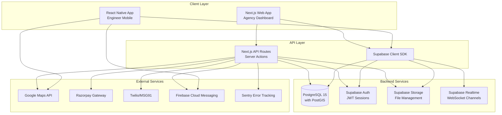

# Design Document

## Overview

The Cueron Partner Agency Management Platform is a dual-application B2B system built on a modern, scalable technology stack. The architecture consists of:

1. **Next.js 14 Web Application** - Server-side rendered dashboard for agency administrators using the App Router, shadcn/ui components, and Tailwind CSS
2. **React Native Mobile Application** - Cross-platform mobile app for field engineers with offline-first capabilities
3. **Supabase Backend** - PostgreSQL database with built-in authentication, real-time subscriptions, file storage, and Row Level Security
4. **Third-party Integrations** - Google Maps for location services, Razorpay for payments, Firebase Cloud Messaging for push notifications, and Twilio/MSG91 for SMS

The system emphasizes real-time data synchronization, security, and operational efficiency for managing HVAC service partnerships across India.

## Architecture

### System Architecture Diagram



### Technology Stack Summary

**Frontend:**
- Web: Next.js 14 (App Router), TypeScript, shadcn/ui, Tailwind CSS, Zustand, TanStack Query
- Mobile: React Native 0.72+, TypeScript, React Native Paper, Zustand, TanStack Query

**Backend:**
- Database: PostgreSQL 15 with PostGIS extension (via Supabase)
- Authentication: Supabase Auth with phone OTP
- Storage: Supabase Storage with CDN
- Real-time: Supabase Realtime (WebSocket-based)

**Infrastructure:**
- Web Hosting: Vercel with edge functions
- Mobile: iOS App Store, Google Play Store
- CI/CD: GitHub Actions
- Monitoring: Sentry for error tracking

## Components and Interfaces

### Web Application Components

#### 1. Authentication Module
- **Login Screen**: Phone number input with OTP verification
- **Session Management**: JWT token handling with httpOnly cookies
- **Role-Based Access**: Admin, Manager, Viewer role enforcement

#### 2. Dashboard Module
- **Overview Cards**: Jobs today, active engineers, pending payments, monthly revenue
- **Quick Actions**: Assign job, add engineer, view analytics
- **Recent Activity Feed**: Real-time job status updates
- **Performance Charts**: Jobs trend, revenue trend, engineer utilization

#### 3. Jobs Management Module
- **Jobs List View**: Filterable table with status, urgency, location, assigned engineer
- **Job Detail View**: Complete job information with map, client details, service history
- **Job Assignment Interface**: Engineer selection with availability status and distance calculation
- **Real-time Tracking**: Live engineer location on map with status timeline

#### 4. Team Management Module
- **Engineers List**: Table with availability status, current job, performance metrics
- **Engineer Profile**: Personal info, certifications, job history, performance stats
- **Add Engineer Form**: Multi-step form with validation
- **Bulk Upload**: CSV import with validation and error reporting
- **Team Map View**: Real-time location of all active engineers

#### 5. Analytics Module
- **Performance Dashboard**: Jobs completed, revenue, ratings, response times
- **Engineer Analytics**: Individual performance comparison, utilization rates
- **Monthly Reports**: Exportable reports in CSV/PDF format
- **Trend Analysis**: Time-series charts for key metrics

#### 6. Settings Module
- **Agency Profile**: Edit agency information, bank details, service areas
- **User Management**: Add/remove users, assign roles
- **Notification Preferences**: Configure alert channels
- **Integration Settings**: API keys, webhook configurations

### Mobile Application Components

#### 1. Authentication Module
- **Phone Login**: OTP-based authentication
- **Biometric Auth**: Fingerprint/Face ID for quick access
- **Session Persistence**: Secure token storage

#### 2. Jobs Module
- **Jobs List**: Assigned jobs with status badges and scheduled times
- **Job Detail Screen**: Client info, location map, equipment details, service checklist
- **Navigation Integration**: Launch Google Maps/Apple Maps with destination
- **Status Update**: Quick status change buttons with confirmation

#### 3. Service Delivery Module
- **Service Checklist**: Interactive checklist with completion tracking
- **Photo Capture**: Before/after photos with camera integration
- **Parts Used**: Add parts with quantity and cost
- **Engineer Notes**: Text input for service observations
- **Client Signature**: Signature capture canvas

#### 4. Profile Module
- **Engineer Profile**: Personal info, certifications, performance stats
- **Job History**: Past jobs with ratings and feedback
- **Performance Metrics**: Success rate, average rating, jobs completed
- **Availability Toggle**: Set availability status

#### 5. Notifications Module
- **Push Notifications**: Job assignments, status updates, payment alerts
- **In-app Notifications**: Notification center with read/unread status
- **Notification Settings**: Configure notification preferences

### API Interfaces

#### Agency Management APIs
```typescript
// Agency Registration
POST /api/agencies/register
Request: { name, type, registration_number, gstn, contact_person, phone, email, ... }
Response: { agency_id, status: 'pending_approval' }

// Get Agency Details
GET /api/agencies/{id}
Response: { id, name, type, partnership_tier, engineer_capacity, status, ... }

// Update Agency
PATCH /api/agencies/{id}
Request: { name?, contact_person?, bank_details?, ... }
Response: { updated_agency }

// Get Agency Metrics
GET /api/agencies/{id}/metrics?period=monthly
Response: { jobs_completed, revenue, avg_rating, engineers_utilized, ... }
```

#### Engineer Management APIs
```typescript
// List Engineers
GET /api/agencies/{id}/engineers?status=available
Response: { engineers: [...], total, page, limit }

// Add Engineer
POST /api/agencies/{id}/engineers
Request: { name, phone, email, certifications, skill_level, ... }
Response: { engineer_id, status: 'active' }

// Update Engineer
PATCH /api/engineers/{id}
Request: { availability_status?, current_location?, ... }
Response: { updated_engineer }

// Bulk Upload Engineers
POST /api/engineers/bulk-upload
Request: FormData with CSV file
Response: { success_count, error_count, errors: [...] }
```

#### Job Management APIs
```typescript
// List Jobs
GET /api/agencies/{id}/jobs?status=assigned&urgency=urgent
Response: { jobs: [...], total, page, limit }

// Get Job Details
GET /api/jobs/{id}
Response: { id, job_number, client_info, location, status, assigned_engineer, ... }

// Assign Engineer to Job
POST /api/jobs/{id}/assign
Request: { engineer_id }
Response: { job, notification_sent: true }

// Update Job Status
PATCH /api/jobs/{id}/status
Request: { status, location?, notes? }
Response: { updated_job, status_history }

// Complete Job
POST /api/jobs/{id}/complete
Request: { checklist, photos_before, photos_after, parts_used, signature_url, notes }
Response: { completed_job, payment_created }
```

#### Real-time Subscriptions
```typescript
// Subscribe to job updates
SUBSCRIBE realtime:job:{jobId}
Events: { event: 'UPDATE', payload: { status, location, ... } }

// Subscribe to agency notifications
SUBSCRIBE realtime:agency:{agencyId}
Events: { event: 'INSERT', table: 'jobs', payload: { new_job } }

// Subscribe to engineer location updates
SUBSCRIBE realtime:engineer:{engineerId}
Events: { event: 'UPDATE', payload: { current_location, last_update } }
```

## Data Models

### Core Database Schema

#### Agencies Table
```typescript
interface Agency {
  id: string; // UUID
  name: string;
  type: 'ITI' | 'Training' | 'Service' | 'Vendor';
  registration_number: string;
  gstn: string;
  nsdc_code?: string;
  
  // Contact
  contact_person: string;
  phone: string;
  email: string;
  
  // Location
  primary_location: {
    city: string;
    state: string;
    pincode: string;
    lat: number;
    lng: number;
  };
  service_areas: string[]; // Array of cities
  
  // Partnership
  partnership_tier: 'standard' | 'premium' | 'enterprise';
  partnership_model: 'job_placement' | 'dedicated_resource' | 'training_placement';
  engineer_capacity: number;
  
  // Bank Details (encrypted)
  bank_account_name?: string;
  bank_account_number?: string; // Encrypted
  bank_ifsc?: string;
  pan_number?: string; // Encrypted
  
  // Status
  status: 'pending_approval' | 'active' | 'suspended' | 'inactive';
  onboarded_at?: Date;
  created_at: Date;
  updated_at: Date;
}
```

#### Engineers Table
```typescript
interface Engineer {
  id: string; // UUID
  agency_id: string; // Foreign key to agencies
  
  // Personal Info
  name: string;
  phone: string;
  email?: string;
  photo_url?: string;
  
  // Certifications
  certifications: Array<{
    type: 'PMKVY' | 'ITI' | 'NSDC' | 'Other';
    level: number;
    cert_number: string;
    verified: boolean;
    issued_date?: Date;
  }>;
  skill_level: 1 | 2 | 3 | 4 | 5;
  specializations: string[]; // ['Cold Storage', 'Industrial HVAC', ...]
  
  // Work Status
  availability_status: 'available' | 'on_job' | 'offline' | 'on_leave';
  current_location?: {
    type: 'Point';
    coordinates: [number, number]; // [longitude, latitude]
  };
  last_location_update?: Date;
  
  // Performance
  total_jobs_completed: number;
  average_rating: number; // 0.00 to 5.00
  total_ratings: number;
  success_rate: number; // Percentage
  
  // Employment
  employment_type: 'full_time' | 'part_time' | 'gig' | 'apprentice';
  created_at: Date;
  updated_at: Date;
}
```

#### Jobs Table
```typescript
interface Job {
  id: string; // UUID
  job_number: string; // JOB-2025-5678
  
  // Client
  client_id?: string;
  client_name: string;
  client_phone: string;
  
  // Job Details
  job_type: 'AMC' | 'Repair' | 'Installation' | 'Emergency';
  equipment_type: string;
  equipment_details?: {
    brand?: string;
    model?: string;
    serial_number?: string;
    capacity?: string;
  };
  issue_description?: string;
  
  // Location
  site_location: {
    address: string;
    city: string;
    state: string;
    lat: number;
    lng: number;
  };
  
  // Assignment
  assigned_agency_id?: string;
  assigned_engineer_id?: string;
  required_skill_level: 1 | 2 | 3 | 4 | 5;
  
  // Scheduling
  scheduled_time?: Date;
  urgency: 'emergency' | 'urgent' | 'normal' | 'scheduled';
  response_deadline?: Date;
  
  // Status & Timeline
  status: 'pending' | 'assigned' | 'accepted' | 'travelling' | 'onsite' | 'completed' | 'cancelled';
  assigned_at?: Date;
  accepted_at?: Date;
  started_at?: Date;
  completed_at?: Date;
  
  // Financial
  service_fee?: number;
  payment_status: 'pending' | 'processing' | 'paid' | 'failed';
  
  // Service Completion
  service_checklist?: Array<{
    item: string;
    completed: boolean;
    notes?: string;
  }>;
  parts_used?: Array<{
    name: string;
    quantity: number;
    cost: number;
  }>;
  photos_before?: string[]; // URLs
  photos_after?: string[]; // URLs
  engineer_notes?: string;
  client_signature_url?: string;
  
  // Rating
  client_rating?: 1 | 2 | 3 | 4 | 5;
  client_feedback?: string;
  
  created_at: Date;
  updated_at: Date;
}
```

#### Payments Table
```typescript
interface Payment {
  id: string; // UUID
  agency_id?: string;
  job_id?: string;
  
  // Payment Details
  amount: number;
  payment_type: 'job_payment' | 'subscription' | 'advance' | 'refund';
  
  // Status
  status: 'pending' | 'processing' | 'completed' | 'failed' | 'refunded';
  
  // Payment Method
  payment_method?: string; // 'razorpay', 'bank_transfer', 'upi'
  payment_gateway_id?: string; // External payment ID
  
  // Invoice
  invoice_number?: string;
  invoice_url?: string;
  invoice_date?: Date;
  due_date?: Date;
  
  // Timestamps
  paid_at?: Date;
  created_at: Date;
  updated_at: Date;
}
```

### Database Indexes

```sql
-- Performance optimization indexes
CREATE INDEX idx_jobs_status ON jobs(status);
CREATE INDEX idx_jobs_agency ON jobs(assigned_agency_id) WHERE assigned_agency_id IS NOT NULL;
CREATE INDEX idx_jobs_engineer ON jobs(assigned_engineer_id) WHERE assigned_engineer_id IS NOT NULL;
CREATE INDEX idx_jobs_scheduled_time ON jobs(scheduled_time);
CREATE INDEX idx_engineers_availability ON engineers(availability_status) WHERE availability_status = 'available';
CREATE INDEX idx_engineers_location ON engineers USING GIST (current_location);
CREATE INDEX idx_payments_agency ON payments(agency_id);
```

### Row Level Security Policies

```sql
-- Agencies can only see their own data
CREATE POLICY "Agencies see own data"
ON agencies FOR SELECT
USING (auth.uid() IN (
  SELECT user_id FROM agency_users WHERE agency_id = agencies.id
));

-- Agencies can see their engineers
CREATE POLICY "Agencies see own engineers"
ON engineers FOR SELECT
USING (agency_id IN (
  SELECT id FROM agencies 
  WHERE auth.uid() IN (SELECT user_id FROM agency_users WHERE agency_id = agencies.id)
));

-- Agencies see assigned jobs
CREATE POLICY "Agencies see assigned jobs"
ON jobs FOR SELECT
USING (assigned_agency_id IN (
  SELECT id FROM agencies 
  WHERE auth.uid() IN (SELECT user_id FROM agency_users WHERE agency_id = agencies.id)
));

-- Engineers see their own profile
CREATE POLICY "Engineers see own data"
ON engineers FOR SELECT
USING (auth.uid() = user_id);

-- Engineers see their assigned jobs
CREATE POLICY "Engineers see assigned jobs"
ON jobs FOR SELECT
USING (assigned_engineer_id IN (
  SELECT id FROM engineers WHERE auth.uid() = user_id
));
```


## Correctness Properties

*A property is a characteristic or behavior that should hold true across all valid executions of a system—essentially, a formal statement about what the system should do. Properties serve as the bridge between human-readable specifications and machine-verifiable correctness guarantees.*

### Agency Registration Properties

**Property 1: Agency creation with pending status**
*For any* valid agency registration data, creating a new agency should result in a record with status 'pending_approval'
**Validates: Requirements 1.1**

**Property 2: GSTN uniqueness enforcement**
*For any* existing agency with a GSTN, attempting to register another agency with the same GSTN should be rejected
**Validates: Requirements 1.2**

**Property 3: NSDC code storage**
*For any* agency registration that includes an NSDC code, the stored agency record should contain the NSDC code value
**Validates: Requirements 1.3**

**Property 4: Registration notification**
*For any* successful agency registration, a confirmation notification should be sent to the registered phone number
**Validates: Requirements 1.4**

**Property 5: Bank detail encryption**
*For any* agency registration with bank account details, the stored bank account number should not be in plaintext (should be encrypted)
**Validates: Requirements 1.5**

### Engineer Management Properties

**Property 6: Engineer-agency linkage**
*For any* engineer created by an agency, the engineer record should have agency_id matching the creating agency's id
**Validates: Requirements 2.1**

**Property 7: Engineer phone uniqueness**
*For any* existing engineer with a phone number, attempting to create another engineer with the same phone should be rejected
**Validates: Requirements 2.2**

**Property 8: Certification data completeness**
*For any* engineer created with certification information, the stored record should contain certification type, level, and verification status
**Validates: Requirements 2.3**

**Property 9: Default availability status**
*For any* newly created engineer where availability_status is not explicitly set, the engineer should have availability_status 'available'
**Validates: Requirements 2.4**

**Property 10: Bulk engineer creation**
*For any* valid CSV file with N engineer records, the bulk upload should create N engineer records in the database
**Validates: Requirements 2.5**

### Job Viewing and Assignment Properties

**Property 11: Agency job isolation**
*For any* agency querying the jobs list, all returned jobs should have assigned_agency_id matching that agency's id
**Validates: Requirements 3.1**

**Property 12: Job detail completeness**
*For any* job detail view, the rendered output should contain client information, location, equipment type, and required skill level
**Validates: Requirements 3.2**

**Property 13: Job list sorting**
*For any* jobs list query, the returned jobs should be sorted first by urgency (emergency > urgent > normal > scheduled) then by scheduled_time
**Validates: Requirements 3.3**

**Property 14: Skill requirement highlighting**
*For any* job with a required_skill_level value, the job detail rendering should include highlighting of the skill requirement
**Validates: Requirements 3.4**

**Property 15: Distance calculation accuracy**
*For any* job location and engineer location, the calculated distance should match the actual geographic distance within acceptable tolerance
**Validates: Requirements 3.5**

**Property 16: Assignment availability validation**
*For any* engineer assignment attempt, if the engineer's availability_status is not 'available', the assignment should be rejected
**Validates: Requirements 4.1**

**Property 17: Assignment status update**
*For any* successful job assignment, the job status should be 'assigned' and assigned_at timestamp should be set
**Validates: Requirements 4.2**

**Property 18: Engineer status on assignment**
*For any* successful job assignment, the assigned engineer's availability_status should change to 'on_job'
**Validates: Requirements 4.3**

**Property 19: Assignment notification**
*For any* successful job assignment, a push notification should be sent to the assigned engineer
**Validates: Requirements 4.4**

**Property 20: Prevent double assignment**
*For any* engineer with availability_status 'on_job', attempting to assign them to another job should be rejected
**Validates: Requirements 4.5**

### Mobile Job Reception Properties

**Property 21: Job notification navigation**
*For any* job notification opened by an engineer, the mobile application should load and display the complete job information
**Validates: Requirements 5.2**

**Property 22: Navigation options presence**
*For any* job detail view in the mobile application, navigation options to the service location should be available
**Validates: Requirements 5.3**

**Property 23: Assigned jobs sorting**
*For any* engineer's assigned jobs list, the jobs should be sorted by scheduled_time in ascending order
**Validates: Requirements 5.4**

**Property 24: Job acceptance status update**
*For any* job accepted by an engineer, the job status should change to 'accepted' and accepted_at timestamp should be set
**Validates: Requirements 5.5**

### Job Status Tracking Properties

**Property 25: Status history recording**
*For any* job status change, a status history record should be created with the new status, timestamp, and engineer location
**Validates: Requirements 6.1**

**Property 26: Location tracking activation**
*For any* job status update to 'travelling', location tracking should be activated for the assigned engineer
**Validates: Requirements 6.2**

**Property 27: Onsite arrival timestamp**
*For any* job status change to 'onsite', the job's started_at timestamp should be set to the current time
**Validates: Requirements 6.3**

**Property 28: Real-time status broadcast**
*For any* job status update, subscribers to that job's Supabase Realtime channel should receive the update event
**Validates: Requirements 6.4**

**Property 29: Onsite feature enablement**
*For any* job with status 'onsite', the mobile application should enable access to service checklist and photo capture features
**Validates: Requirements 6.5**

### Service Completion Properties

**Property 30: Checklist display completeness**
*For any* job with a service checklist, all checklist items should be displayed in the mobile application
**Validates: Requirements 7.1**

**Property 31: Checklist completion persistence**
*For any* checklist item marked as completed, the job record should reflect the updated completion status
**Validates: Requirements 7.2**

**Property 32: Before photo upload**
*For any* before photo captured by an engineer, the image should be uploaded to Supabase Storage and the URL stored in photos_before array
**Validates: Requirements 7.3**

**Property 33: After photo association**
*For any* after photo captured by an engineer, the image should be uploaded and the URL stored in the job's photos_after array
**Validates: Requirements 7.4**

**Property 34: Completion enablement**
*For any* job where all mandatory checklist items are marked complete, the job completion action should be enabled
**Validates: Requirements 7.5**

**Property 35: Completion checklist validation**
*For any* job completion attempt, if any mandatory checklist items are incomplete, the completion should be rejected
**Validates: Requirements 8.1**

**Property 36: Signature upload**
*For any* captured client signature, the signature image should be uploaded to Supabase Storage and the URL stored in client_signature_url
**Validates: Requirements 8.3**

**Property 37: Job completion status update**
*For any* job marked as complete, the job status should be 'completed' and completed_at timestamp should be set
**Validates: Requirements 8.4**

**Property 38: Engineer availability restoration**
*For any* job completion, the assigned engineer's availability_status should change back to 'available'
**Validates: Requirements 8.5**

### Location Tracking Properties

**Property 39: Periodic location updates**
*For any* engineer on a job, location updates should occur at intervals of approximately 30 seconds (±5 seconds tolerance)
**Validates: Requirements 9.1**

**Property 40: PostGIS point storage**
*For any* location update, the stored coordinates should be in PostGIS POINT format with valid longitude and latitude
**Validates: Requirements 9.2**

**Property 41: Team map completeness**
*For any* agency viewing the team map, all engineers with availability_status 'on_job' or 'travelling' should be displayed
**Validates: Requirements 9.3**

**Property 42: Location timestamp recording**
*For any* location update, the engineer's last_location_update timestamp should be set to the update time
**Validates: Requirements 9.4**

**Property 43: Offline location persistence**
*For any* engineer changing to 'offline' status, the current_location value should remain unchanged from the last known location
**Validates: Requirements 9.5**

### Analytics and Performance Properties

**Property 44: Analytics dashboard completeness**
*For any* agency analytics dashboard view, the display should include jobs completed count, total revenue, and average rating
**Validates: Requirements 10.1**

**Property 45: Performance chart presence**
*For any* performance data display, charts and visualizations should be included in the rendered output
**Validates: Requirements 10.3**

**Property 46: Engineer metrics calculation**
*For any* engineer performance query, the calculated metrics should include success_rate, average_rating, and total_jobs_completed
**Validates: Requirements 10.4**

**Property 47: Analytics data isolation**
*For any* agency requesting analytics, all returned data should belong only to that agency (no data from other agencies)
**Validates: Requirements 10.5**

### Payment Management Properties

**Property 48: Payment list isolation**
*For any* agency viewing payments, all returned payment records should have agency_id matching that agency's id
**Validates: Requirements 11.1**

**Property 49: Automatic payment creation**
*For any* job marked as completed, a payment record with status 'pending' should be created
**Validates: Requirements 11.2**

**Property 50: Payment processing update**
*For any* payment processed, the payment status should be updated and paid_at timestamp should be set
**Validates: Requirements 11.3**

**Property 51: Invoice uniqueness**
*For any* generated invoice, the invoice_number should be unique across all invoices and the invoice_url should be stored
**Validates: Requirements 11.4**

**Property 52: Payment detail encryption**
*For any* stored payment with bank account information, the bank account number should be encrypted (not plaintext)
**Validates: Requirements 11.5**

### Authentication Properties

**Property 53: OTP sending**
*For any* phone number submitted for authentication, an OTP should be sent via Supabase Auth
**Validates: Requirements 12.1**

**Property 54: OTP verification**
*For any* correct OTP submitted, authentication should succeed; for any incorrect OTP, authentication should fail
**Validates: Requirements 12.3**

**Property 55: Session creation**
*For any* successful OTP verification, a session with a valid JWT token should be created
**Validates: Requirements 12.4**

**Property 56: Session persistence**
*For any* successful authentication, subsequent API requests should include the session token
**Validates: Requirements 12.5**

### Authorization and Security Properties

**Property 57: Role retrieval on login**
*For any* agency user login, the user's role should be retrieved from the agency_users table
**Validates: Requirements 13.1**

**Property 58: Role-based access control**
*For any* resource access attempt, the user's role should be verified against required permissions before granting access
**Validates: Requirements 13.2**

**Property 59: Row Level Security enforcement**
*For any* database query by an agency user, Row Level Security policies should ensure only that agency's data is accessible
**Validates: Requirements 13.3**

**Property 60: Admin full access**
*For any* user with 'admin' role, all agency management functions should be accessible
**Validates: Requirements 13.4**

**Property 61: Viewer read-only restriction**
*For any* user with 'viewer' role, write operations should be rejected
**Validates: Requirements 13.5**

### Notification Properties

**Property 62: Job assignment notification**
*For any* job assigned to an agency, push notifications should be sent to all users with 'admin' role in that agency
**Validates: Requirements 14.1**

**Property 63: Status update broadcast**
*For any* engineer job status update, the change should be broadcast via the job's Supabase Realtime channel
**Validates: Requirements 14.2**

**Property 64: Real-time subscription delivery**
*For any* web application subscribed to a job's updates, status changes should be delivered in real-time
**Validates: Requirements 14.3**

**Property 65: Critical event SMS**
*For any* critical job event (emergency, cancellation), SMS notifications should be sent to designated agency contacts
**Validates: Requirements 14.4**

**Property 66: Notification content completeness**
*For any* notification sent, the content should include relevant job details and action links
**Validates: Requirements 14.5**

### Engineer Profile Properties

**Property 67: Profile metrics display**
*For any* engineer profile view, the display should include total_jobs_completed and average_rating
**Validates: Requirements 15.1**

**Property 68: Success rate calculation**
*For any* engineer, success_rate should equal (completed_jobs / (completed_jobs + cancelled_jobs)) * 100
**Validates: Requirements 15.2**

**Property 69: Job history completeness**
*For any* engineer job history view, each job should display completion date and client rating
**Validates: Requirements 15.3**

**Property 70: Feedback display**
*For any* job with client_feedback, the feedback text should be displayed alongside the rating
**Validates: Requirements 15.4**

**Property 71: Certification display completeness**
*For any* engineer with certifications, the display should show certification type, level, and verification status for each certification
**Validates: Requirements 15.5**

### Reporting Properties

**Property 72: Report format generation**
*For any* report export request, the report should be generated in the requested format (CSV or PDF)
**Validates: Requirements 16.1**

**Property 73: CSV format correctness**
*For any* CSV export, the file should have proper headers in the first row and comma-separated values
**Validates: Requirements 16.2**

**Property 74: PDF branding**
*For any* PDF export, the document should include agency branding elements
**Validates: Requirements 16.3**

**Property 75: Monthly report completeness**
*For any* monthly report, the content should include jobs_completed, revenue, engineer_utilization, and average_ratings
**Validates: Requirements 16.4**

**Property 76: Export delivery**
*For any* completed export, either a download link should be provided or the report should be sent via email
**Validates: Requirements 16.5**

### Data Security Properties

**Property 77: Sensitive data encryption**
*For any* stored record with bank account number, PAN number, or IFSC code, these fields should be encrypted
**Validates: Requirements 17.1**

**Property 78: JWT validation**
*For any* API request, if the JWT token is invalid or missing, the request should be rejected with 401 status
**Validates: Requirements 17.2**

**Property 79: RLS policy enforcement**
*For any* database query, Row Level Security policies should be applied to restrict data access
**Validates: Requirements 17.3**

**Property 80: File upload validation**
*For any* file upload, if the file type is not allowed or size exceeds the limit, the upload should be rejected
**Validates: Requirements 17.4**

**Property 81: Session expiration handling**
*For any* API request with an expired session token, access should be denied and re-authentication required
**Validates: Requirements 17.5**

### Search and Filter Properties

**Property 82: Filter criteria matching**
*For any* job query with filters applied, all returned jobs should match the specified filter criteria
**Validates: Requirements 18.1**

**Property 83: Status filter accuracy**
*For any* job query filtered by status, all returned jobs should have status matching one of the selected status values
**Validates: Requirements 18.2**

**Property 84: Date range filter accuracy**
*For any* job query filtered by date range, all returned jobs should have scheduled_time within the specified start and end dates
**Validates: Requirements 18.3**

**Property 85: Spatial filter accuracy**
*For any* job query filtered by location, all returned jobs should be within the specified geographic area
**Validates: Requirements 18.4**

**Property 86: Multi-filter combination**
*For any* job query with multiple filters, all returned jobs should satisfy all filter criteria (AND logic)
**Validates: Requirements 18.5**

### Navigation Properties

**Property 87: Map display in job details**
*For any* job detail view in the mobile application, an embedded map showing the service location should be displayed
**Validates: Requirements 19.1**

**Property 88: Navigation app launch**
*For any* direction request from a job, the device's navigation app should be launched with the job's destination coordinates
**Validates: Requirements 19.3**

**Property 89: Dual location display**
*For any* job map view, both the engineer's current location and the job site location should be displayed as markers
**Validates: Requirements 19.4**

### Error Handling Properties

**Property 90: Network error messaging**
*For any* network error in the web application, a user-friendly error message should be displayed
**Validates: Requirements 20.1**

**Property 91: Request retry logic**
*For any* failed API request, the system should retry up to 3 times with exponential backoff before returning an error
**Validates: Requirements 20.2**

**Property 92: Timeout error logging**
*For any* database query timeout, the error should be logged to Sentry with stack trace and a graceful error response returned
**Validates: Requirements 20.3**

**Property 93: Upload retry availability**
*For any* failed file upload in the mobile application, a retry option should be available to the user
**Validates: Requirements 20.4**

**Property 94: Critical error reporting**
*For any* critical error, an error report with stack trace should be sent to the monitoring service (Sentry)
**Validates: Requirements 20.5**

## Error Handling

### Error Categories and Strategies

#### 1. Network Errors
- **Strategy**: Retry with exponential backoff (3 attempts)
- **User Feedback**: Display toast notification with retry option
- **Logging**: Log to Sentry with network conditions context
- **Examples**: Connection timeout, DNS resolution failure, server unreachable

#### 2. Authentication Errors
- **Strategy**: Clear session and redirect to login
- **User Feedback**: Show authentication error message
- **Logging**: Log authentication failures with user context (excluding sensitive data)
- **Examples**: Invalid JWT, expired session, invalid OTP

#### 3. Authorization Errors
- **Strategy**: Return 403 Forbidden with clear message
- **User Feedback**: Display "Access Denied" message with explanation
- **Logging**: Log unauthorized access attempts with user role and resource
- **Examples**: Viewer attempting write operation, accessing another agency's data

#### 4. Validation Errors
- **Strategy**: Return 400 Bad Request with field-specific errors
- **User Feedback**: Highlight invalid fields with error messages
- **Logging**: Log validation failures for pattern analysis
- **Examples**: Invalid phone format, duplicate GSTN, missing required fields

#### 5. Database Errors
- **Strategy**: Rollback transaction, return 500 with generic message
- **User Feedback**: Display "Something went wrong" with support contact
- **Logging**: Log full error with query context to Sentry
- **Examples**: Constraint violation, query timeout, connection pool exhausted

#### 6. File Upload Errors
- **Strategy**: Validate before upload, provide retry mechanism
- **User Feedback**: Show specific error (file too large, invalid type)
- **Logging**: Log upload failures with file metadata
- **Examples**: File size exceeds limit, unsupported file type, storage quota exceeded

#### 7. External Service Errors
- **Strategy**: Implement circuit breaker pattern, fallback to cached data
- **User Feedback**: Show degraded functionality notice
- **Logging**: Log service failures with response codes
- **Examples**: Google Maps API failure, Razorpay timeout, SMS delivery failure

### Error Response Format

```typescript
interface ErrorResponse {
  error: {
    code: string; // Machine-readable error code
    message: string; // Human-readable message
    details?: Record<string, string[]>; // Field-specific errors
    timestamp: string;
    request_id: string; // For support tracking
  };
}

// Example
{
  error: {
    code: 'VALIDATION_ERROR',
    message: 'Invalid input data',
    details: {
      phone: ['Phone number must be 10 digits'],
      gstn: ['GSTN already registered']
    },
    timestamp: '2025-01-15T10:30:00Z',
    request_id: 'req_abc123'
  }
}
```

### Offline Handling (Mobile App)

- **Strategy**: Queue operations locally, sync when online
- **Implementation**: Use React Query with offline persistence
- **User Feedback**: Show offline indicator, queue status
- **Sync Behavior**: Automatic retry on connection restoration

### Error Monitoring

- **Tool**: Sentry for error tracking and alerting
- **Configuration**: 
  - Sample rate: 100% for errors, 10% for performance
  - Environment tags: production, staging, development
  - User context: agency_id, engineer_id, role (no PII)
- **Alerts**: Critical errors trigger immediate notifications

## Testing Strategy

### Unit Testing

**Framework**: Jest 29.7.0 with React Testing Library 14.1.0

**Coverage Requirements**:
- Minimum 80% code coverage for business logic
- 100% coverage for security-critical functions (encryption, authentication, authorization)

**Unit Test Focus Areas**:
1. **Utility Functions**: Encryption/decryption, date formatting, distance calculations
2. **Validation Logic**: Input validation, business rule enforcement
3. **Data Transformations**: API response mapping, database model conversions
4. **React Components**: Component rendering, user interactions, conditional displays
5. **API Route Handlers**: Request validation, response formatting, error handling

**Example Unit Tests**:
```typescript
// Encryption utility test
describe('encrypt/decrypt', () => {
  it('should encrypt and decrypt bank account numbers', () => {
    const accountNumber = '1234567890';
    const encrypted = encrypt(accountNumber);
    expect(encrypted).not.toBe(accountNumber);
    expect(decrypt(encrypted)).toBe(accountNumber);
  });
});

// Component test
describe('JobCard', () => {
  it('should display job details correctly', () => {
    const job = createMockJob();
    render(<JobCard job={job} />);
    expect(screen.getByText(job.job_number)).toBeInTheDocument();
    expect(screen.getByText(job.client_name)).toBeInTheDocument();
  });
});
```

### Property-Based Testing

**Framework**: fast-check 3.15.0 (JavaScript/TypeScript property-based testing library)

**Configuration**: Minimum 100 iterations per property test to ensure comprehensive input coverage

**Property Test Requirements**:
- Each correctness property MUST be implemented as a property-based test
- Each test MUST be tagged with a comment referencing the design document property
- Tag format: `// Feature: cueron-partner-platform, Property {number}: {property_text}`

**Property Test Focus Areas**:
1. **Data Integrity**: Round-trip serialization, encryption/decryption, database operations
2. **Business Rules**: Assignment validation, status transitions, availability checks
3. **Security**: Data isolation, RLS enforcement, permission checks
4. **Calculations**: Distance calculations, metric computations, success rate formulas
5. **Filtering and Sorting**: Query results match criteria, correct ordering

**Example Property Tests**:
```typescript
import fc from 'fast-check';

// Feature: cueron-partner-platform, Property 2: GSTN uniqueness enforcement
describe('Property 2: GSTN uniqueness', () => {
  it('should reject duplicate GSTN registrations', async () => {
    await fc.assert(
      fc.asyncProperty(
        fc.record({
          name: fc.string({ minLength: 3 }),
          gstn: fc.string({ minLength: 15, maxLength: 15 }),
          phone: fc.string({ minLength: 10, maxLength: 10 }),
          email: fc.emailAddress()
        }),
        async (agencyData) => {
          // Create first agency
          const first = await createAgency(agencyData);
          expect(first).toBeDefined();
          
          // Attempt to create second with same GSTN
          const second = await createAgency({
            ...agencyData,
            name: 'Different Name',
            phone: '9999999999'
          });
          
          expect(second).toBeNull(); // Should be rejected
        }
      ),
      { numRuns: 100 }
    );
  });
});

// Feature: cueron-partner-platform, Property 16: Assignment availability validation
describe('Property 16: Assignment availability validation', () => {
  it('should only allow assignment to available engineers', async () => {
    await fc.assert(
      fc.asyncProperty(
        fc.record({
          engineerId: fc.uuid(),
          jobId: fc.uuid(),
          availability: fc.constantFrom('available', 'on_job', 'offline', 'on_leave')
        }),
        async ({ engineerId, jobId, availability }) => {
          // Set engineer availability
          await updateEngineer(engineerId, { availability_status: availability });
          
          // Attempt assignment
          const result = await assignEngineerToJob(jobId, engineerId);
          
          if (availability === 'available') {
            expect(result.success).toBe(true);
          } else {
            expect(result.success).toBe(false);
            expect(result.error).toContain('not available');
          }
        }
      ),
      { numRuns: 100 }
    );
  });
});

// Feature: cueron-partner-platform, Property 68: Success rate calculation
describe('Property 68: Success rate calculation', () => {
  it('should correctly calculate engineer success rate', async () => {
    await fc.assert(
      fc.asyncProperty(
        fc.record({
          completedJobs: fc.nat({ max: 100 }),
          cancelledJobs: fc.nat({ max: 100 })
        }),
        async ({ completedJobs, cancelledJobs }) => {
          const engineer = await createEngineerWithJobHistory(completedJobs, cancelledJobs);
          
          const expectedRate = completedJobs + cancelledJobs === 0 
            ? 0 
            : (completedJobs / (completedJobs + cancelledJobs)) * 100;
          
          expect(engineer.success_rate).toBeCloseTo(expectedRate, 2);
        }
      ),
      { numRuns: 100 }
    );
  });
});
```

### Integration Testing

**Framework**: Playwright 1.40.0 for end-to-end web testing, Detox 20.13.0 for mobile

**Integration Test Focus**:
1. **Authentication Flows**: Complete OTP login process
2. **Job Assignment Workflow**: From job creation to engineer assignment
3. **Service Delivery Flow**: Status updates, checklist completion, photo upload
4. **Real-time Updates**: Verify Supabase Realtime synchronization
5. **Payment Processing**: Invoice generation, payment status updates

**Example Integration Test**:
```typescript
// Web application integration test
test('complete job assignment workflow', async ({ page }) => {
  // Login as agency admin
  await page.goto('/login');
  await page.fill('[name="phone"]', '9876543210');
  await page.click('button:has-text("Send OTP")');
  await page.fill('[name="otp"]', '123456');
  await page.click('button:has-text("Verify")');
  
  // Navigate to jobs
  await page.click('text=Jobs');
  await expect(page).toHaveURL('/dashboard/jobs');
  
  // Select a pending job
  await page.click('[data-testid="job-card"]:first-child');
  
  // Assign engineer
  await page.click('button:has-text("Assign Engineer")');
  await page.selectOption('[name="engineer"]', { index: 0 });
  await page.click('button:has-text("Confirm Assignment")');
  
  // Verify assignment success
  await expect(page.locator('[data-testid="job-status"]')).toHaveText('Assigned');
  await expect(page.locator('[data-testid="assigned-engineer"]')).toBeVisible();
});
```

### Performance Testing

**Tools**: Lighthouse for web performance, React Native Performance Monitor

**Performance Targets**:
- Web Application:
  - First Contentful Paint: < 1.5s
  - Time to Interactive: < 3.5s
  - Lighthouse Performance Score: > 90
- Mobile Application:
  - App Launch Time: < 2s
  - Screen Transition: < 300ms
  - Memory Usage: < 150MB

### Security Testing

**Focus Areas**:
1. **Authentication**: OTP bypass attempts, session hijacking
2. **Authorization**: Role escalation, cross-agency data access
3. **Input Validation**: SQL injection, XSS, file upload exploits
4. **Data Encryption**: Verify sensitive data is encrypted at rest
5. **API Security**: Rate limiting, CORS configuration, JWT validation

**Tools**: OWASP ZAP for vulnerability scanning, manual penetration testing

### Test Data Management

**Strategy**: Use factories and generators for consistent test data

```typescript
// Test data factories
export const createMockAgency = (overrides?: Partial<Agency>): Agency => ({
  id: faker.string.uuid(),
  name: faker.company.name(),
  type: faker.helpers.arrayElement(['ITI', 'Training', 'Service', 'Vendor']),
  gstn: faker.string.alphanumeric(15).toUpperCase(),
  phone: faker.phone.number('##########'),
  email: faker.internet.email(),
  status: 'active',
  ...overrides
});

export const createMockJob = (overrides?: Partial<Job>): Job => ({
  id: faker.string.uuid(),
  job_number: `JOB-2025-${faker.number.int({ min: 1000, max: 9999 })}`,
  client_name: faker.company.name(),
  job_type: faker.helpers.arrayElement(['AMC', 'Repair', 'Installation', 'Emergency']),
  status: 'pending',
  ...overrides
});
```

### Continuous Integration

**CI/CD Pipeline** (GitHub Actions):
1. **On Pull Request**:
   - Run linting (ESLint, Prettier)
   - Run unit tests with coverage report
   - Run property-based tests
   - Build web and mobile applications
   - Run integration tests
2. **On Merge to Main**:
   - Deploy web application to Vercel
   - Create mobile app builds
   - Run smoke tests on staging environment

**Test Execution Order**:
1. Unit tests (fastest feedback)
2. Property-based tests (comprehensive coverage)
3. Integration tests (slower but critical)
4. E2E tests (slowest, run on staging)

This comprehensive testing strategy ensures the Cueron Partner Platform maintains high quality, security, and reliability across all components and user workflows.
