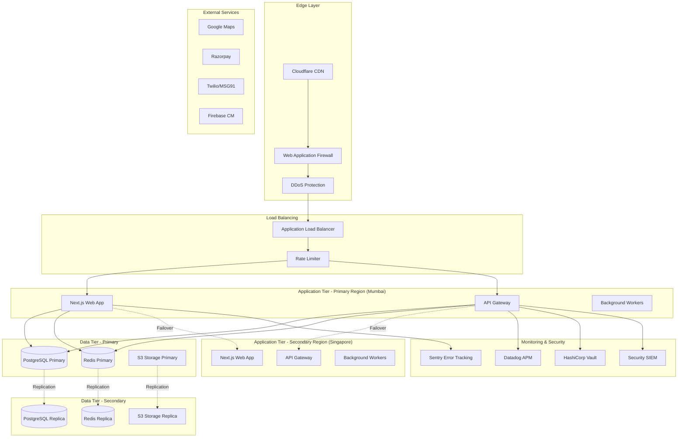
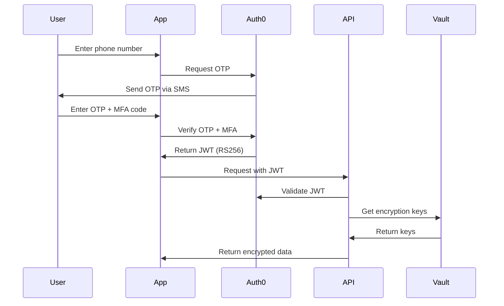
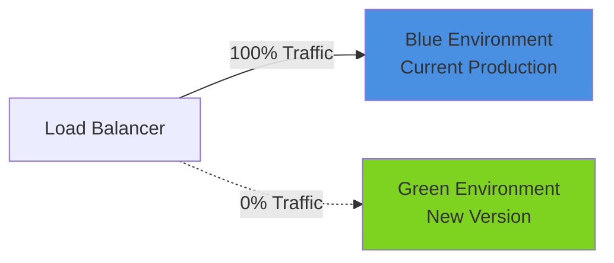

# Design Document: Enterprise Transformation

## Overview

This design document provides the technical architecture and implementation strategy for transforming the Cueron Partner Platform into an enterprise-grade system. The transformation addresses 10 critical areas with 150 requirements spanning scalability, security, compliance, testing, monitoring, and operational excellence.

### Transformation Scope

The enterprise transformation encompasses:

1. **Infrastructure Modernization** - Scalable, resilient cloud architecture
2. **Security Hardening** - Zero-trust security model with defense-in-depth
3. **Quality Assurance** - Comprehensive automated testing at all levels
4. **Compliance Framework** - GDPR, DPDPA, PCI DSS, SOC 2 compliance
5. **Observability Platform** - Full-stack monitoring and alerting
6. **DevOps Excellence** - Automated CI/CD with zero-downtime deployments
7. **API Maturity** - Enterprise-grade API design and documentation
8. **Mobile Optimization** - Offline-first, performant mobile experience
9. **Disaster Recovery** - Multi-region resilience with 4-hour RTO
10. **Technical Excellence** - High code quality and minimal technical debt

### Current State Assessment

**Strengths:**
- Solid foundation with Next.js 14, React Native, Supabase
- Basic security implemented (encryption, RLS, JWT)
- Core features functional (jobs, engineers, payments)
- Monorepo structure with shared packages

**Gaps:**
- No comprehensive testing (missing PBT, E2E tests)
- Limited monitoring and observability
- No disaster recovery or business continuity plan
- Missing compliance framework
- No performance optimization or caching
- Incomplete security hardening
- Manual deployment processes
- No API versioning or documentation
- Missing mobile offline capabilities
- Technical debt accumulating

### Target State Vision

**Enterprise-Grade Platform:**
- 99.9% uptime with multi-region deployment
- Sub-500ms API response times at 10x scale
- Comprehensive automated testing (80%+ coverage)
- Full regulatory compliance (GDPR, DPDPA, PCI DSS)
- Real-time monitoring with predictive alerting
- Zero-downtime deployments with automated rollback
- World-class API documentation and developer experience
- Offline-first mobile apps with conflict resolution
- 4-hour RTO, 1-hour RPO disaster recovery
- Maintainable codebase with minimal technical debt

## Architecture

### High-Level Architecture Diagram



### Technology Stack Evolution

**Current Stack:**
- Frontend: Next.js 14, React Native 0.72+
- Backend: Supabase (PostgreSQL, Auth, Storage, Realtime)
- Hosting: Vercel (web), App Stores (mobile)
- Monitoring: Sentry (basic)

**Enhanced Enterprise Stack:**

**Infrastructure:**
- Cloud Provider: AWS (primary), GCP (secondary for DR)
- CDN: Cloudflare Enterprise with WAF and DDoS protection
- Load Balancer: AWS ALB with health checks and auto-scaling
- Container Orchestration: AWS ECS Fargate or EKS
- Infrastructure as Code: Terraform with GitOps via ArgoCD

**Data Layer:**
- Primary Database: Supabase PostgreSQL 15 with PostGIS
- Read Replicas: 2x replicas for query distribution
- Caching: Redis Cluster (AWS ElastiCache) for sessions and data
- Message Queue: AWS SQS for async processing
- Search: Elasticsearch for full-text search
- Data Warehouse: AWS Redshift for analytics

**Security:**
- Secrets Management: HashiCorp Vault or AWS Secrets Manager
- Key Management: AWS KMS for encryption key rotation
- WAF: Cloudflare WAF with OWASP ruleset
- SIEM: Splunk or AWS Security Hub
- Vulnerability Scanning: Snyk, Dependabot, Trivy
- Identity Provider: Auth0 or AWS Cognito for SSO

**Monitoring & Observability:**
- APM: Datadog or New Relic for distributed tracing
- Logging: ELK Stack (Elasticsearch, Logstash, Kibana)
- Metrics: Prometheus + Grafana
- Error Tracking: Sentry with full context
- Uptime Monitoring: Pingdom or UptimeRobot
- Alerting: PagerDuty or Opsgenie

**Testing:**
- Unit Testing: Jest, Vitest
- Property-Based Testing: fast-check
- E2E Testing: Playwright (web), Detox (mobile)
- Load Testing: k6 or Artillery
- Security Testing: OWASP ZAP, Burp Suite
- Contract Testing: Pact

**CI/CD:**
- Version Control: GitHub with branch protection
- CI/CD: GitHub Actions with self-hosted runners
- Container Registry: AWS ECR
- Artifact Storage: AWS S3
- Deployment: Blue-Green via AWS CodeDeploy
- Feature Flags: LaunchDarkly or Unleash

## Components and Interfaces

### 1. Scalability and Performance Architecture

#### 1.1 Caching Strategy

**Multi-Layer Caching:**


```typescript
// Layer 1: CDN (Cloudflare) - Static assets, images
// Layer 2: Application Cache (Redis) - API responses, session data
// Layer 3: Database Query Cache - Materialized views, computed aggregates

// Redis Cache Configuration
interface CacheConfig {
  ttl: {
    session: 3600,        // 1 hour
    apiResponse: 300,     // 5 minutes
    staticData: 86400,    // 24 hours
    userProfile: 1800     // 30 minutes
  };
  maxMemory: '4gb';
  evictionPolicy: 'allkeys-lru';
}

// Cache Implementation
class CacheService {
  async get<T>(key: string): Promise<T | null>;
  async set<T>(key: string, value: T, ttl?: number): Promise<void>;
  async invalidate(pattern: string): Promise<void>;
  async mget<T>(keys: string[]): Promise<(T | null)[]>;
}
```

#### 1.2 Database Optimization

**Connection Pooling:**
```typescript
// Supabase Connection Pool Configuration
const supabaseConfig = {
  db: {
    poolMin: 20,
    poolMax: 100,
    idleTimeoutMillis: 30000,
    connectionTimeoutMillis: 2000
  }
};
```

**Read Replicas:**
- Primary: Write operations, critical reads
- Replica 1: Analytics queries, reporting
- Replica 2: Background jobs, bulk operations

**Query Optimization:**
- Add composite indexes for common query patterns
- Use EXPLAIN ANALYZE for slow queries
- Implement query result caching
- Use materialized views for complex aggregations

#### 1.3 Rate Limiting

```typescript
// Rate Limiter Middleware
interface RateLimitConfig {
  windowMs: 60000;        // 1 minute
  max: 100;               // 100 requests per window
  standardHeaders: true;
  legacyHeaders: false;
  handler: (req, res) => {
    res.status(429).json({
      error: 'Too many requests',
      retryAfter: res.getHeader('Retry-After')
    });
  };
}

// Different limits for different endpoints
const rateLimits = {
  '/api/auth/*': { max: 5, windowMs: 60000 },      // 5/min for auth
  '/api/jobs/*': { max: 100, windowMs: 60000 },    // 100/min for jobs
  '/api/analytics/*': { max: 20, windowMs: 60000 } // 20/min for analytics
};
```

### 2. Automated Testing Architecture

#### 2.1 Testing Pyramid

```
         /\
        /E2E\          10% - End-to-End Tests (Playwright, Detox)
       /------\
      /Integr-\        20% - Integration Tests (API, Database)
     /----------\
    /---Unit-----\     70% - Unit Tests (Jest, Vitest)
   /--------------\
```

#### 2.2 Property-Based Testing

```typescript
// Example Property Test using fast-check
import fc from 'fast-check';

describe('Job Assignment Properties', () => {
  it('Property: Assigning available engineer updates status', () => {
    fc.assert(
      fc.property(
        fc.record({
          jobId: fc.uuid(),
          engineerId: fc.uuid(),
          engineerStatus: fc.constant('available')
        }),
        async ({ jobId, engineerId, engineerStatus }) => {
          // Arrange
          await createJob(jobId);
          await createEngineer(engineerId, engineerStatus);
          
          // Act
          const result = await assignJob(jobId, engineerId);
          
          // Assert
          expect(result.job.status).toBe('assigned');
          expect(result.engineer.availability_status).toBe('on_job');
        }
      ),
      { numRuns: 1000 } // Run 1000 random test cases
    );
  });
});
```

#### 2.3 E2E Testing Strategy

**Web E2E Tests (Playwright):**
```typescript
// tests/e2e/job-assignment.spec.ts
test('Complete job assignment workflow', async ({ page }) => {
  // Login
  await page.goto('/login');
  await page.fill('[data-testid="phone"]', '+919876543210');
  await page.click('[data-testid="send-otp"]');
  await page.fill('[data-testid="otp"]', '123456');
  await page.click('[data-testid="verify"]');
  
  // Navigate to jobs
  await page.click('[data-testid="nav-jobs"]');
  await expect(page).toHaveURL('/dashboard/jobs');
  
  // Assign engineer
  await page.click('[data-testid="job-row-1"]');
  await page.click('[data-testid="assign-button"]');
  await page.selectOption('[data-testid="engineer-select"]', 'engineer-1');
  await page.click('[data-testid="confirm-assign"]');
  
  // Verify assignment
  await expect(page.locator('[data-testid="job-status"]')).toHaveText('Assigned');
});
```

**Mobile E2E Tests (Detox):**
```typescript
// e2e/job-acceptance.e2e.ts
describe('Job Acceptance Flow', () => {
  it('should accept job and update status', async () => {
    // Login
    await element(by.id('phone-input')).typeText('9876543210');
    await element(by.id('send-otp-button')).tap();
    await element(by.id('otp-input')).typeText('123456');
    await element(by.id('verify-button')).tap();
    
    // View job
    await element(by.id('jobs-tab')).tap();
    await element(by.id('job-card-1')).tap();
    
    // Accept job
    await element(by.id('accept-button')).tap();
    await expect(element(by.id('job-status'))).toHaveText('Accepted');
  });
});
```

### 3. Security Architecture

#### 3.1 Authentication Flow



#### 3.2 Security Headers

```typescript
// Security Headers Middleware
const securityHeaders = {
  'Strict-Transport-Security': 'max-age=31536000; includeSubDomains; preload',
  'Content-Security-Policy': "default-src 'self'; script-src 'self' 'unsafe-inline' 'unsafe-eval'; style-src 'self' 'unsafe-inline';",
  'X-Frame-Options': 'DENY',
  'X-Content-Type-Options': 'nosniff',
  'X-XSS-Protection': '1; mode=block',
  'Referrer-Policy': 'strict-origin-when-cross-origin',
  'Permissions-Policy': 'geolocation=(self), microphone=(), camera=(self)'
};
```

#### 3.3 Encryption Strategy

```typescript
// Encryption Service using AWS KMS
class EncryptionService {
  private kmsClient: KMSClient;
  
  async encrypt(plaintext: string, keyId: string): Promise<string> {
    const command = new EncryptCommand({
      KeyId: keyId,
      Plaintext: Buffer.from(plaintext)
    });
    const response = await this.kmsClient.send(command);
    return Buffer.from(response.CiphertextBlob).toString('base64');
  }
  
  async decrypt(ciphertext: string, keyId: string): Promise<string> {
    const command = new DecryptCommand({
      KeyId: keyId,
      CiphertextBlob: Buffer.from(ciphertext, 'base64')
    });
    const response = await this.kmsClient.send(command);
    return Buffer.from(response.Plaintext).toString('utf-8');
  }
  
  async rotateKey(oldKeyId: string, newKeyId: string): Promise<void> {
    // Re-encrypt all data with new key
  }
}
```

### 4. Compliance Framework

#### 4.1 Data Classification

```typescript
enum DataClassification {
  PUBLIC = 'public',           // No restrictions
  INTERNAL = 'internal',       // Internal use only
  CONFIDENTIAL = 'confidential', // Encrypted, access controlled
  RESTRICTED = 'restricted'    // Highest security, audit logged
}

interface DataField {
  name: string;
  classification: DataClassification;
  encrypted: boolean;
  piiType?: 'name' | 'phone' | 'email' | 'address' | 'financial';
  retentionDays: number;
  consentRequired: boolean;
}

// Example: User data classification
const userDataSchema: DataField[] = [
  { name: 'id', classification: DataClassification.INTERNAL, encrypted: false, retentionDays: 2555 },
  { name: 'phone', classification: DataClassification.RESTRICTED, encrypted: true, piiType: 'phone', retentionDays: 2555, consentRequired: true },
  { name: 'email', classification: DataClassification.CONFIDENTIAL, encrypted: true, piiType: 'email', retentionDays: 2555, consentRequired: true },
  { name: 'bank_account', classification: DataClassification.RESTRICTED, encrypted: true, piiType: 'financial', retentionDays: 2555, consentRequired: true }
];
```

#### 4.2 Consent Management

```typescript
interface ConsentRecord {
  userId: string;
  consentType: 'data_collection' | 'data_processing' | 'marketing' | 'third_party_sharing';
  granted: boolean;
  timestamp: Date;
  ipAddress: string;
  userAgent: string;
  version: string; // Privacy policy version
}

class ConsentService {
  async recordConsent(consent: ConsentRecord): Promise<void>;
  async checkConsent(userId: string, consentType: string): Promise<boolean>;
  async revokeConsent(userId: string, consentType: string): Promise<void>;
  async exportUserData(userId: string): Promise<UserDataExport>;
  async deleteUserData(userId: string): Promise<void>;
}
```

#### 4.3 Audit Logging

```typescript
interface AuditLog {
  timestamp: Date;
  userId: string;
  action: string;
  resource: string;
  resourceId: string;
  ipAddress: string;
  userAgent: string;
  result: 'success' | 'failure';
  metadata: Record<string, any>;
}

// Audit all sensitive operations
const auditedOperations = [
  'user.login',
  'user.logout',
  'user.password_change',
  'data.export',
  'data.delete',
  'payment.process',
  'admin.role_change',
  'config.update'
];
```

### 5. Monitoring and Observability

#### 5.1 Distributed Tracing

```typescript
// OpenTelemetry Configuration
import { NodeTracerProvider } from '@opentelemetry/sdk-trace-node';
import { Resource } from '@opentelemetry/resources';
import { SemanticResourceAttributes } from '@opentelemetry/semantic-conventions';

const provider = new NodeTracerProvider({
  resource: new Resource({
    [SemanticResourceAttributes.SERVICE_NAME]: 'cueron-api',
    [SemanticResourceAttributes.SERVICE_VERSION]: '1.0.0',
  }),
});

// Instrument HTTP requests
import { HttpInstrumentation } from '@opentelemetry/instrumentation-http';
import { ExpressInstrumentation } from '@opentelemetry/instrumentation-express';

registerInstrumentations({
  instrumentations: [
    new HttpInstrumentation(),
    new ExpressInstrumentation(),
  ],
});
```

#### 5.2 Structured Logging

```typescript
// Winston Logger Configuration
import winston from 'winston';

const logger = winston.createLogger({
  level: 'info',
  format: winston.format.combine(
    winston.format.timestamp(),
    winston.format.errors({ stack: true }),
    winston.format.json()
  ),
  defaultMeta: { service: 'cueron-api' },
  transports: [
    new winston.transports.File({ filename: 'error.log', level: 'error' }),
    new winston.transports.File({ filename: 'combined.log' }),
  ],
});

// Log structure
interface LogEntry {
  timestamp: string;
  level: 'info' | 'warn' | 'error';
  message: string;
  service: string;
  traceId?: string;
  userId?: string;
  metadata?: Record<string, any>;
}
```

#### 5.3 Alerting Rules

```yaml
# Prometheus Alert Rules
groups:
  - name: api_alerts
    rules:
      - alert: HighErrorRate
        expr: rate(http_requests_total{status=~"5.."}[5m]) > 0.01
        for: 5m
        labels:
          severity: critical
        annotations:
          summary: "High error rate detected"
          description: "Error rate is {{ $value }} errors/sec"
      
      - alert: HighLatency
        expr: histogram_quantile(0.95, rate(http_request_duration_seconds_bucket[5m])) > 0.5
        for: 5m
        labels:
          severity: warning
        annotations:
          summary: "High API latency detected"
          description: "P95 latency is {{ $value }}s"
      
      - alert: DatabaseConnectionPoolExhausted
        expr: pg_stat_database_numbackends / pg_settings_max_connections > 0.8
        for: 2m
        labels:
          severity: critical
        annotations:
          summary: "Database connection pool near capacity"
```

## Data Models

### Enhanced Data Models for Enterprise Features

```typescript
// Audit Log Model
interface AuditLog {
  id: string;
  timestamp: Date;
  user_id: string;
  action: string;
  resource_type: string;
  resource_id: string;
  ip_address: string;
  user_agent: string;
  result: 'success' | 'failure';
  metadata: JSONB;
  retention_until: Date;
}

// Consent Record Model
interface ConsentRecord {
  id: string;
  user_id: string;
  consent_type: string;
  granted: boolean;
  granted_at: Date;
  revoked_at?: Date;
  ip_address: string;
  user_agent: string;
  policy_version: string;
}

// Security Event Model
interface SecurityEvent {
  id: string;
  timestamp: Date;
  event_type: 'failed_login' | 'suspicious_activity' | 'data_breach' | 'unauthorized_access';
  severity: 'low' | 'medium' | 'high' | 'critical';
  user_id?: string;
  ip_address: string;
  description: string;
  resolved: boolean;
  resolved_at?: Date;
  resolved_by?: string;
}

// Performance Metric Model
interface PerformanceMetric {
  id: string;
  timestamp: Date;
  metric_name: string;
  metric_value: number;
  tags: Record<string, string>;
  aggregation_period: '1m' | '5m' | '1h' | '1d';
}
```

## Correctness Properties

*A property is a characteristic or behavior that should hold true across all valid executions of a system-essentially, a formal statement about what the system should do. Properties serve as the bridge between human-readable specifications and machine-verifiable correctness guarantees.*

### Scalability Properties

**Property 1: Response time under load**
*For any* API endpoint, when concurrent requests increase to 10,000, the p95 response time should remain under 500ms
**Validates: Requirements 1.1**

**Property 2: Cache hit ratio**
*For any* frequently accessed data, the cache hit ratio should exceed 90% after warm-up period
**Validates: Requirements 1.3**

**Property 3: Rate limiting enforcement**
*For any* user making requests, when request count exceeds 100 per minute, subsequent requests should receive 429 status
**Validates: Requirements 1.4**

### Testing Properties

**Property 4: Test coverage maintenance**
*For any* code commit, the overall test coverage should not decrease below 80%
**Validates: Requirements 2.1**

**Property 5: Property test execution**
*For any* property-based test, the test should execute minimum 1000 random test cases
**Validates: Requirements 2.2**

**Property 6: E2E test completeness**
*For any* critical user journey, there should exist an automated E2E test validating the complete flow
**Validates: Requirements 2.4**

### Security Properties

**Property 7: MFA enforcement**
*For any* admin user login attempt, multi-factor authentication should be required
**Validates: Requirements 3.1**

**Property 8: JWT expiration**
*For any* JWT token issued, the expiration time should be maximum 15 minutes
**Validates: Requirements 3.3**

**Property 9: Encryption at rest**
*For any* PII data stored, the data should be encrypted using AES-256-GCM
**Validates: Requirements 4.3**

**Property 10: File malware scanning**
*For any* file upload, the file should be scanned for malware before storage
**Validates: Requirements 3.5**

### Compliance Properties

**Property 11: Consent requirement**
*For any* personal data collection, explicit user consent should be obtained and recorded
**Validates: Requirements 4.1**

**Property 12: Data deletion SLA**
*For any* user data deletion request, all personal data should be permanently deleted within 30 days
**Validates: Requirements 4.2**

**Property 13: Audit log retention**
*For any* audit log entry, the log should be retained for minimum 7 years
**Validates: Requirements 4.6**

### Monitoring Properties

**Property 14: Error capture completeness**
*For any* application error, the error should be captured with full stack trace and context
**Validates: Requirements 5.3**

**Property 15: Alert delivery**
*For any* critical alert trigger, on-call engineers should be notified within 1 minute
**Validates: Requirements 5.5**

**Property 16: Uptime SLA**
*For any* 30-day period, system uptime should be minimum 99.9%
**Validates: Requirements 5.10**

### Disaster Recovery Properties

**Property 17: Backup frequency**
*For any* 6-hour period, an automated database backup should be created
**Validates: Requirements 6.1**

**Property 18: Backup restoration**
*For any* backup file, restoration should complete within 2 hours (RTO)
**Validates: Requirements 6.2**

**Property 19: Failover time**
*For any* primary region failure, failover to secondary region should complete within 15 minutes
**Validates: Requirements 6.6**

### DevOps Properties

**Property 20: Automated deployment**
*For any* code merge to main branch, automated tests, build, and staging deployment should execute
**Validates: Requirements 7.1**

**Property 21: Rollback capability**
*For any* failed deployment, automatic rollback should complete within 5 minutes
**Validates: Requirements 7.3, 7.12**

**Property 22: Zero-downtime migration**
*For any* database migration, the migration should execute without service interruption
**Validates: Requirements 7.8**

### API Properties

**Property 23: API documentation completeness**
*For any* public API endpoint, OpenAPI 3.0 documentation with examples should exist
**Validates: Requirements 8.1**

**Property 24: Backward compatibility**
*For any* API version, backward compatibility should be maintained for minimum 12 months
**Validates: Requirements 8.2**

**Property 25: Error response standardization**
*For any* API error, the response should include standardized error code and message
**Validates: Requirements 8.3**

### Mobile Properties

**Property 26: Offline queue persistence**
*For any* operation performed offline, the operation should be queued and synced when connection restores
**Validates: Requirements 9.1**

**Property 27: Local storage encryption**
*For any* data stored locally on mobile device, the data should be encrypted using device keychain
**Validates: Requirements 9.2**

**Property 28: App startup performance**
*For any* app launch, the startup time should be under 2 seconds
**Validates: Requirements 9.5**

### Code Quality Properties

**Property 29: TypeScript strict mode**
*For any* TypeScript file, strict mode should be enabled with zero 'any' types
**Validates: Requirements 10.1**

**Property 30: Cyclomatic complexity**
*For any* function, cyclomatic complexity should be below 10
**Validates: Requirements 10.3**

## Error Handling

### Centralized Error Handling

```typescript
// Error Types
class AppError extends Error {
  constructor(
    public statusCode: number,
    public message: string,
    public code: string,
    public isOperational: boolean = true
  ) {
    super(message);
    Object.setPrototypeOf(this, AppError.prototype);
  }
}

class ValidationError extends AppError {
  constructor(message: string, public fields: Record<string, string>) {
    super(400, message, 'VALIDATION_ERROR');
  }
}

class AuthenticationError extends AppError {
  constructor(message: string = 'Authentication failed') {
    super(401, message, 'AUTHENTICATION_ERROR');
  }
}

class AuthorizationError extends AppError {
  constructor(message: string = 'Insufficient permissions') {
    super(403, message, 'AUTHORIZATION_ERROR');
  }
}

// Global Error Handler
function errorHandler(err: Error, req: Request, res: Response, next: NextFunction) {
  if (err instanceof AppError) {
    // Log operational errors
    logger.warn({
      message: err.message,
      code: err.code,
      statusCode: err.statusCode,
      path: req.path,
      method: req.method,
      userId: req.user?.id
    });
    
    return res.status(err.statusCode).json({
      error: {
        code: err.code,
        message: err.message,
        ...(err instanceof ValidationError && { fields: err.fields })
      }
    });
  }
  
  // Log programming errors
  logger.error({
    message: err.message,
    stack: err.stack,
    path: req.path,
    method: req.method
  });
  
  // Send to Sentry
  Sentry.captureException(err);
  
  // Return generic error
  return res.status(500).json({
    error: {
      code: 'INTERNAL_SERVER_ERROR',
      message: 'An unexpected error occurred'
    }
  });
}
```

### Circuit Breaker Pattern

```typescript
class CircuitBreaker {
  private failureCount = 0;
  private lastFailureTime?: Date;
  private state: 'CLOSED' | 'OPEN' | 'HALF_OPEN' = 'CLOSED';
  
  constructor(
    private threshold: number = 5,
    private timeout: number = 60000
  ) {}
  
  async execute<T>(fn: () => Promise<T>): Promise<T> {
    if (this.state === 'OPEN') {
      if (Date.now() - this.lastFailureTime!.getTime() > this.timeout) {
        this.state = 'HALF_OPEN';
      } else {
        throw new Error('Circuit breaker is OPEN');
      }
    }
    
    try {
      const result = await fn();
      this.onSuccess();
      return result;
    } catch (error) {
      this.onFailure();
      throw error;
    }
  }
  
  private onSuccess() {
    this.failureCount = 0;
    this.state = 'CLOSED';
  }
  
  private onFailure() {
    this.failureCount++;
    this.lastFailureTime = new Date();
    
    if (this.failureCount >= this.threshold) {
      this.state = 'OPEN';
    }
  }
}
```

## Testing Strategy

### Test Coverage Requirements

- **Unit Tests:** 80% minimum coverage
  - All business logic functions
  - Utility functions
  - Data transformations
  - Validation logic

- **Integration Tests:** All critical workflows
  - API endpoint integration
  - Database operations
  - Third-party service integration
  - Authentication flows

- **Property-Based Tests:** All correctness properties
  - 1000+ test cases per property
  - Random input generation
  - Invariant validation

- **E2E Tests:** All user journeys
  - Web: Login, job assignment, analytics
  - Mobile: Login, job acceptance, completion

- **Performance Tests:** Load and stress testing
  - 10,000 concurrent users
  - API response time validation
  - Database query performance

- **Security Tests:** OWASP Top 10
  - SQL injection
  - XSS attacks
  - CSRF protection
  - Authentication bypass

### Testing Tools

- **Unit/Integration:** Jest, Vitest
- **Property-Based:** fast-check
- **E2E Web:** Playwright
- **E2E Mobile:** Detox
- **Performance:** k6, Artillery
- **Security:** OWASP ZAP, Burp Suite
- **Contract:** Pact
- **Visual Regression:** Percy, Chromatic

### CI/CD Testing Pipeline

```yaml
# .github/workflows/test.yml
name: Test Pipeline

on: [push, pull_request]

jobs:
  unit-tests:
    runs-on: ubuntu-latest
    steps:
      - uses: actions/checkout@v3
      - name: Run unit tests
        run: pnpm test:unit --coverage
      - name: Upload coverage
        uses: codecov/codecov-action@v3
  
  integration-tests:
    runs-on: ubuntu-latest
    services:
      postgres:
        image: postgres:15
      redis:
        image: redis:7
    steps:
      - uses: actions/checkout@v3
      - name: Run integration tests
        run: pnpm test:integration
  
  e2e-tests:
    runs-on: ubuntu-latest
    steps:
      - uses: actions/checkout@v3
      - name: Run E2E tests
        run: pnpm test:e2e
  
  security-tests:
    runs-on: ubuntu-latest
    steps:
      - uses: actions/checkout@v3
      - name: Run security scan
        run: pnpm test:security
```

## Deployment Strategy

### Blue-Green Deployment



**Deployment Steps:**
1. Deploy new version to Green environment
2. Run smoke tests on Green
3. Gradually shift traffic: 10% → 50% → 100%
4. Monitor metrics and error rates
5. Rollback to Blue if issues detected
6. After 24 hours, Green becomes new Blue

### Canary Deployment

```typescript
// Feature Flag Configuration
interface FeatureFlag {
  name: string;
  enabled: boolean;
  rolloutPercentage: number;
  userSegments?: string[];
  startDate?: Date;
  endDate?: Date;
}

// Gradual Rollout Strategy
const rolloutSchedule = [
  { day: 1, percentage: 10, segment: 'internal' },
  { day: 2, percentage: 25, segment: 'beta_users' },
  { day: 3, percentage: 50, segment: 'all' },
  { day: 5, percentage: 100, segment: 'all' }
];
```

## Conclusion

This design document provides a comprehensive technical blueprint for transforming the Cueron Partner Platform into an enterprise-grade system. The architecture emphasizes:

- **Scalability:** Multi-region deployment with auto-scaling
- **Security:** Defense-in-depth with zero-trust model
- **Reliability:** 99.9% uptime with automated failover
- **Quality:** Comprehensive testing at all levels
- **Compliance:** Built-in GDPR, DPDPA, PCI DSS compliance
- **Observability:** Full-stack monitoring and alerting
- **Maintainability:** Clean architecture with minimal technical debt

Implementation should follow the phased approach outlined in the Executive Summary, starting with foundational infrastructure (monitoring, testing, CI/CD) before scaling to advanced features.
