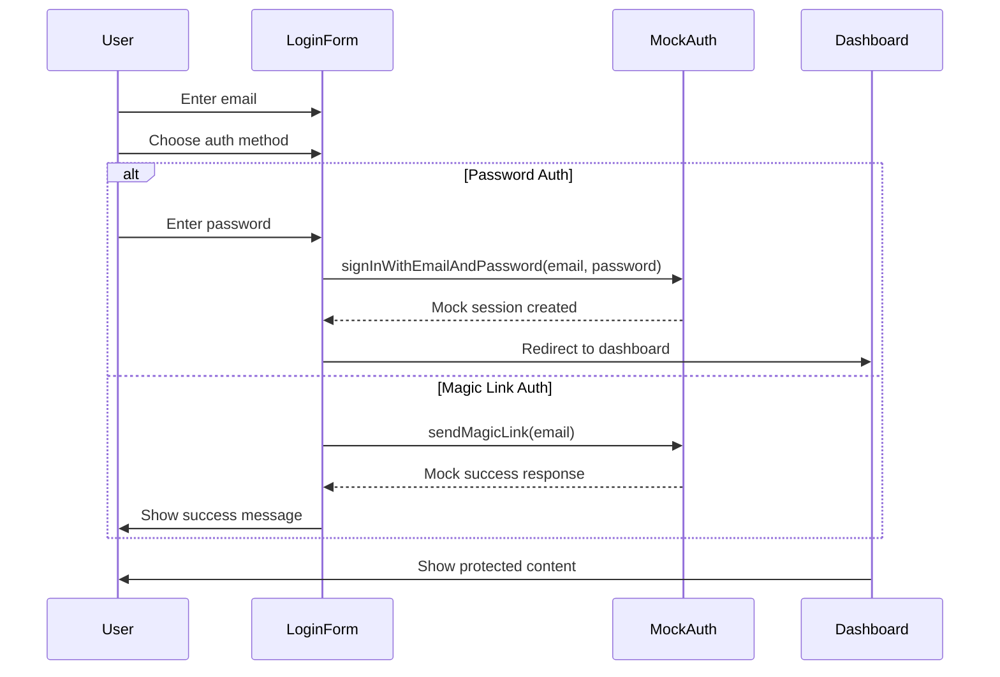

# Web Authentication UI

This directory contains the authentication UI components for the Cueron Partner Platform web application.

## Components

### LoginForm
The initial login form that allows users to authenticate using email with either magic links or password.

**Features:**
- Email input with validation
- Toggle between magic link and password authentication
- Password input field
- Loading states during authentication
- Error handling and display
- Form validation

**Usage:**
```tsx
import { LoginForm } from '@/components/auth/LoginForm';

<LoginForm onEmailSent={(email) => console.log('Magic link sent to:', email)} />
```

### ProtectedRoute
A wrapper component that protects pages requiring authentication.

**Features:**
- Automatic redirect to login if not authenticated
- Loading state while checking authentication
- Customizable redirect path
- Customizable loading component

**Usage:**
```tsx
import { ProtectedRoute } from '@/components/auth/ProtectedRoute';

export default function DashboardPage() {
  return (
    <ProtectedRoute>
      <DashboardContent />
    </ProtectedRoute>
  );
}
```

**Higher-Order Component:**
```tsx
import { withAuth } from '@/components/auth/ProtectedRoute';

function MyProtectedPage() {
  return <div>Protected content</div>;
}

export default withAuth(MyProtectedPage);
```

## Hooks

### useAuth
Manages authentication state and provides current user and session.

**Returns:**
- `user`: Current authenticated user or null
- `session`: Current session or null
- `loading`: Boolean indicating if auth state is loading
- `error`: Error object if authentication check failed

**Usage:**
```tsx
import { useAuth } from '@/hooks/useAuth';

function MyComponent() {
  const { user, session, loading, error } = useAuth();
  
  if (loading) return <div>Loading...</div>;
  if (!user) return <div>Not authenticated</div>;
  
  return <div>Welcome {user.email}</div>;
}
```

### useRequireAuth
Hook that automatically redirects to login if not authenticated.

**Usage:**
```tsx
import { useRequireAuth } from '@/hooks/useAuth';

function MyProtectedComponent() {
  const { user, loading } = useRequireAuth();
  
  if (loading) return <div>Loading...</div>;
  
  return <div>Welcome {user.email}</div>;
}
```

### useSession
Provides session management functions.

**Returns:**
- `session`: Current session or null
- `loading`: Boolean indicating if session is loading
- `refreshSession`: Function to refresh the session
- `signOut`: Function to sign out and redirect to login

**Usage:**
```tsx
import { useSession } from '@/hooks/useAuth';

function MyComponent() {
  const { session, signOut, refreshSession } = useSession();
  
  return (
    <div>
      <button onClick={signOut}>Sign Out</button>
      <button onClick={refreshSession}>Refresh Session</button>
    </div>
  );
}
```

### useUserProfile
Fetches and provides user profile data from the database.

**Returns:**
- `user`: Current authenticated user
- `profile`: User profile data (engineer or agency_user)
- `loading`: Boolean indicating if profile is loading
- `error`: Error object if profile fetch failed

**Usage:**
```tsx
import { useUserProfile } from '@/hooks/useAuth';

function MyComponent() {
  const { user, profile, loading, error } = useUserProfile();
  
  if (loading) return <div>Loading profile...</div>;
  if (error) return <div>Error: {error.message}</div>;
  
  return (
    <div>
      <p>Type: {profile?.type}</p>
      <p>Role: {profile?.role}</p>
      <p>Agency: {profile?.agency?.name}</p>
    </div>
  );
}
```

## Pages

### /login
The login page that handles the authentication flow.

**Flow:**
1. User enters email address
2. User chooses between magic link or password authentication
3. If magic link: Link is sent via Supabase Auth (MOCK IMPLEMENTATION)
4. If password: User enters password and signs in (MOCK IMPLEMENTATION)
5. Session is created in localStorage
6. User is redirected to dashboard

### /dashboard
Protected dashboard page that requires authentication.

**Features:**
- Automatic redirect to login if not authenticated
- User profile display
- Sign out functionality
- Quick stats cards
- Coming soon notice for full features

## Authentication Flow



## Validation

### Email Validation
- Must be a valid email format
- Validated using standard email validation

### Password Validation
- Must be at least 6 characters
- No other restrictions for now

## Error Handling

All components include comprehensive error handling:
- Network errors
- Invalid credentials
- Session expiration
- Database errors
- Validation errors

Errors are displayed in user-friendly messages with appropriate styling.

## Loading States

All components include loading states:
- Spinner animations during async operations
- Disabled inputs during loading
- Loading text indicators
- Skeleton screens where appropriate

## Security

Authentication is handled through a mock system for development purposes:
- Sessions are stored in localStorage
- No real authentication is performed
- For production, this will be replaced with Supabase Auth

## Testing

To test the authentication flow:

1. Start the development server:
   ```bash
   pnpm dev
   ```

2. Navigate to `http://localhost:3000`

3. You'll be redirected to `/login`

4. Enter a valid email address

5. Choose authentication method:
   - For magic link: Click "Send Magic Link" (will show success message)
   - For password: Enter "password123" and click "Sign In"

6. You'll be redirected to `/dashboard`

## Future Enhancements

- Remember device functionality
- Multi-factor authentication
- Social authentication providers
- Password reset functionality